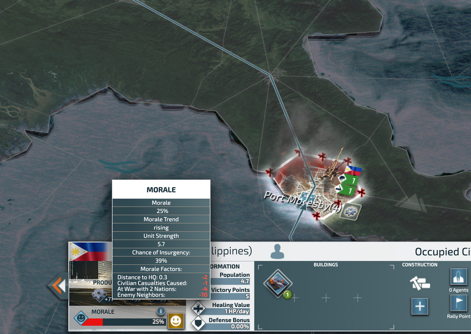

# 😀 Morale

Every province or city in CON has morale. Morale decides local resource production, population growth, and whether insurgencies spawn.

## Morale Ticks

Every time at midnight server time, morale will update and tick once.

Every city or province has a target morale that it will move towards with each morale tick.

### Target Morale

<table><thead><tr><th width="368">Land Type</th><th>Target Morale</th></tr></thead><tbody><tr><td>Homeland Cities</td><td>90%</td></tr><tr><td>Annexed Cities</td><td>75%</td></tr><tr><td>Occupied Cities</td><td>75%</td></tr><tr><td>Provinces</td><td>100%</td></tr></tbody></table>

During each morale tick, the morale of every single piece of land will move up by a certain amount:

$$
morale\thinspace increase = \frac{target\thinspace morale - actual\thinspace morale}{8}
$$

[**Morale factors**](morale.md#morale-factors) _affect_ this **target morale**, giving it either a positive or a negative modifier.

> Since the morale moves up by the difference between the target morale and the actual morale, having a high target morale is ideal. Aim to remove negative penalties.

## Morale Effects

Morale will have an effect on mobilization speeds, construction times, and local resource production.

### Mobilization & Construction

As morale decreases from 90% to 25%, the efficiency of construction and mobilization decreases _linearly_ from 100% to 75%, and therefore, the multiplier for the time taken for construction and mobilization increases _linearly_ from 100% to 133+1/3%

The final construction and mobilization time of a city is:

$$
Duration\thinspace Multiplier = \left\{\begin{array}{lr}
        100\%, & \text{for m}>90\%\\
        \frac{260}{170+m}, & \text{for }90\%\geq m\%\geq 25\%\\
        133.\overline3\%, & \text{for }m \leq25\%
        \end{array}\right\}
$$

In other words, in a clamping formula:

$$
Duration\thinspace Muliplier = clamp(100\%, \frac{260}{170+m}, 133.\overline{3}\%)
$$

where m is the morale percentage in both formulas.

> This means that having a higher morale will decrease the speed of your mobilizations, up to 90% morale. Therefore, having a higher morale will be beneficial in **cities**. However, it is generally not necessary to build extra building to increase the morale, managing your morale to decrease the amount of negative penalties is sufficient.

### Resource Production

The effect of morale on local resource production is:

$$
Multiplier = m*0.8+0.25
$$

## Morale Factors

<figure><figcaption></figcaption></figure>

The morale of the city relies on many factors.&#x20;

#### Distance to Headquarters

When the city is further from the capital, the morale will suffer penalties.

> You can relocate your headquarters, but this is not neccescary as it is only a small reduction.

$$
Distance\thinspace Penalty = round(max(5*Distance-0.1,\thinspace0))
$$

* Civilian Casualties caused: This is determined by the number of people you killed in the city. This doesn't really matter as much, as the factor doesn't really make a difference, but for example, if you strike a city with a lot of navy, then a lot of civilians will be killed, which could affect your morale, but only in a minimal way.
* War with how many nations? This makes a big difference in your morale increase. Generally, try not to go over being at 5 wars at one time, as that leads to your chances of insurgencies to increase by a lot. When you have an overwhelming amount of wars occurring, your cities (even your homeland) will start losing morale, causing a chain of insurgents even in your own homeland.
*   Enemy neighbours: Wars with neighbours&#x20;

    This is similar to nations you were at war with, except sometimes you are not bordering that country, meaning that your morale will be slightly higher. However, the difference is not significant, so you don’t need to purposely not share a border with a country you are at war with

     
